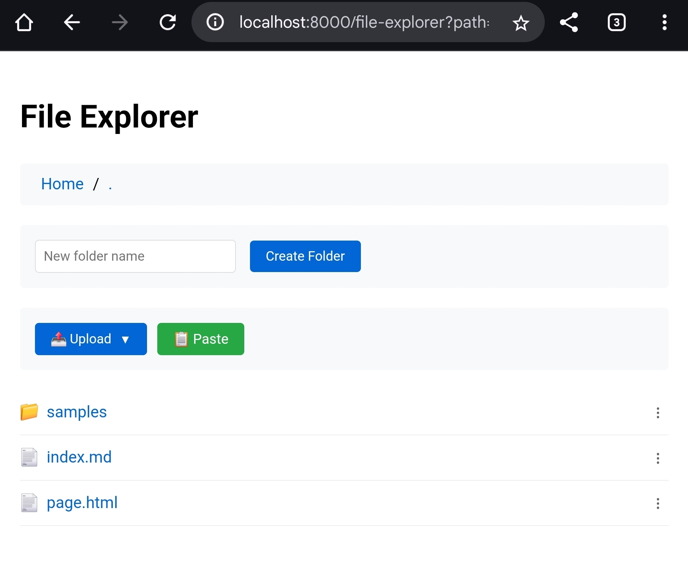

# Remote File Manager

A web-based file management system that provides HTTP server functionality for
browsing and managing files on remote machines. The application creates a
`/file-explorer` endpoint that enables comprehensive file operations within the
working directory.

## Overview

Remote File Manager is designed to streamline file management operations on
remote servers through a web interface. The tool combines static HTTP server
capabilities with dynamic file management features, making it particularly
valuable for remote server administration and development workflows.

## Key Features

- **Web-based File Explorer**: Intuitive interface for browsing directory
  structures
- **File Management Operations**: Create, delete, rename, and organize files and
  folders
- **Text File Editing**: Built-in editor for modifying text-based files
- **Clipboard Upload**: Paste screenshots and images directly from clipboard to upload files
- **Static File Serving**: Serves HTML files and other static content
- **Remote Access**: Optimized for SSH port forwarding scenarios



## Installation

### Prerequisites

- Deno runtime environment

### Install Command

```bash
deno install -g --allow-write --allow-net --allow-read -f -r -n rfm jsr:@sobanieca/remote-file-manager
```

To update to the latest version, run the same installation command.

## Usage

Navigate to your desired working directory and execute:

```bash
rfm
```

The server will start and provide access to the file management interface
through your web browser on default port (8000).

To change port execute:

```bash
rfm -p 5432
```

## Remote File Management with SSH Port Forwarding

Remote File Manager is particularly useful when managing files on remote servers through SSH connections. By using SSH port forwarding, you can securely access the web interface from your local machine.

### Setting up SSH Port Forwarding 

To access Remote File Manager running on a remote server from your local machine, use SSH with the `-L` option to forward a local port to the remote server:

1. **Connect to the remote server with port forwarding:**
   ```bash
   ssh -L 8000:localhost:8000 user@remote-server.com
   ```

2. **Navigate to your target directory on the remote server:**
   ```bash
   cd /path/to/your/project
   ```

3. **Start Remote File Manager:**
   ```bash
   rfm
   ```

4. **Access the file manager from your local browser:**
   Open `http://localhost:8000/file-explorer` in your local web browser

